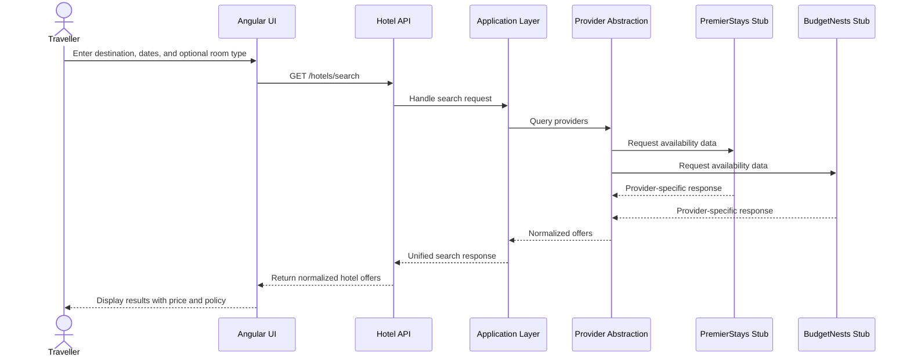
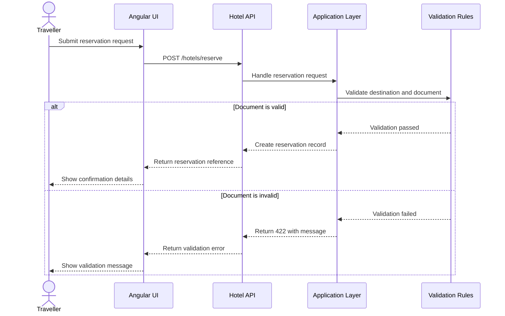
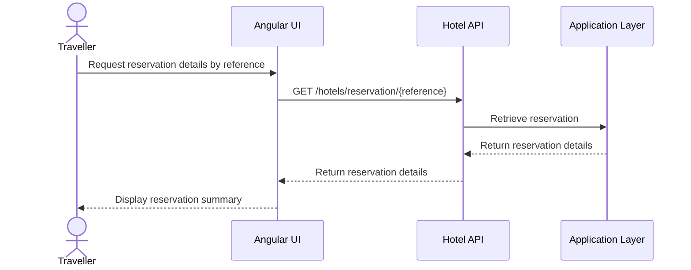

# Sequence Diagrams

## 1. Hotel Search Flow

```mermaid
sequenceDiagram
    actor Traveller
    participant UI as Angular UI
    participant API as Hotel API
    participant App as Application Layer
    participant Provider as Provider Abstraction
    participant Premier as PremierStays Stub
    participant Budget as BudgetNests Stub

    Traveller->>UI: Enter destination, dates, and optional room type
    UI->>API: GET /hotels/search
    API->>App: Handle search request
    App->>Provider: Query providers
    Provider->>Premier: Request availability data
    Provider->>Budget: Request availability data
    Premier-->>Provider: Provider-specific response
    Budget-->>Provider: Provider-specific response
    Provider-->>App: Normalized offers
    App-->>API: Unified search response
    API-->>UI: Return normalized hotel offers
    UI-->>Traveller: Display results with price and policy
```

## 2. Reservation Flow

```mermaid
sequenceDiagram
    actor Traveller
    participant UI as Angular UI
    participant API as Hotel API
    participant App as Application Layer
    participant Validation as Validation Rules

    Traveller->>UI: Submit reservation request
    UI->>API: POST /hotels/reserve
    API->>App: Handle reservation request
    App->>Validation: Validate destination and document
    alt Document is valid
        Validation-->>App: Validation passed
        App-->>API: Create reservation record
        API-->>UI: Return reservation reference
        UI-->>Traveller: Show confirmation details
    else Document is invalid
        Validation-->>App: Validation failed
        App-->>API: Return 422 with message
        API-->>UI: Return validation error
        UI-->>Traveller: Show validation message
    end
```

## 3. Reservation Lookup Flow

```mermaid
sequenceDiagram
    actor Traveller
    participant UI as Angular UI
    participant API as Hotel API
    participant App as Application Layer

    Traveller->>UI: Request reservation details by reference
    UI->>API: GET /hotels/reservation/{reference}
    API->>App: Retrieve reservation
    App-->>API: Return reservation details
    API-->>UI: Return reservation details
    UI-->>Traveller: Display reservation summary
```
